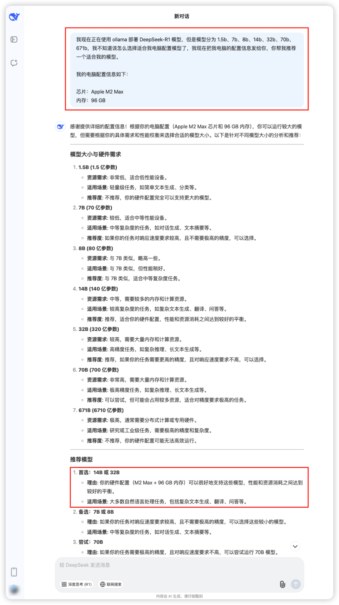

# DeepSeek + Dify 本地部署私有化知识库


**背景**：公司开发产品，由于产品特性不能对外开源，其使用文档也不开源，为了更好地进行技术支持，所以需要本地部署私有化知识库。另外 DeepSeek 由于使用人员较多，经常【服务器繁忙，请稍后再试】。

**思路**：下载 DeepSeek-R1 模型，再下载 Dify 应用框架，在 Dify 中配置大模型，这样就实现了本地部署私有化知识库。由于 DeepSeek-R1 模型下载需要 ollama 命令下载、Dify 项目需要再 Docker 环境安装项目依赖、所以需要先下载 ollama 和 Docker。


那就走着~

## 01 <br/>ollama 下载与安装

**ollama 下载**

[ollama](https://ollama.com/)是一个开源的本地模型服务，它可以让开发者在本地运行各种模型。如何下载 ollama，如下图：


**ollama 安装**

和普通应用安装一样，安装成功后，应用栏会出现一个小羊驼。

## 02 <br/>DeepSeek-R1 下载

::: tip

终端下载 DeepSeek-R1 模型期间，不能关闭 ollama 客户端（对，就是那个应用栏小羊驼）。

:::

### 识别下载 DeepSeek-R1 哪款模型

将本地电脑配置设备信息发给 [DeepSeek](https://chat.deepseek.com/)，然后 DeepSeek 会推荐给你一个适合的模型。


提示词如下，可拷贝：

::: code-group

```markdown [macOS]
我现在正在使用 ollama 部署 DeepSeek-R1 模型，但是模型分为 1.5b、7b、8b、14b、32b、70b、671b，我不知道该怎么选择适合我电脑配置模型了，我现在把我电脑的配置信息发给你，你帮我推荐一个适合我的模型。

我的电脑配置信息如下：
芯片：Apple M2 Max
内存：96 GB
```

```markdown [windows]
我现在正在使用 ollama 部署 DeepSeek-R1 模型，但是模型分为 1.5b、7b、8b、14b、32b、70b、671b，我不知道该怎么选择适合我电脑配置模型了，我现在把我电脑的配置信息发给你，你帮我推荐一个适合我的模型。

我的电脑配置信息如下：
系统：windows 11
运行内存：32G
专用GPU显存：6G
共享GPU内存：15.9G
```

:::



### 模型下载

**DeepSeek-R1 模型下载**

进入 [ollama](https://ollama.com/) 官网，点击 [DeepSeek-R1](https://ollama.com/library/deepseek-r1), 如下图：


选择上一步你咨询 DeepSeek 推荐的模型，然后选择（我选择 32b，为了速度，我也选了 14b），然后点击右侧【复制】按钮。


打开本地终端，粘贴刚刚复制的命令：


下载完成后，在本地终端输入你的问题，然后回车，专断也是能回答的，如下图。由于不是界面，操作很不方便，所以需要搭建 Dify，Dify 是什么，后面会介绍。


**Embedding 向量模型下载**

后面会用到，这里一并下载了，这里推荐 [bge-m3](https://ollama.com/library/bge-m3) Embedding 向量模型, 点击【复制】按钮，如下图：


打开本地终端，粘贴刚刚复制的命令：


## 03 <br/>Docker 下载与安装

**Docker 下载**

[Docker](https://www.docker.com/) 是一个开源的应用容器引擎，它可以让开发者将应用程序及其依赖项打包成一个可移植的容器，然后在任何支持 Docker 的平台上运行。如何下载 Docker，如下图：


**Docker 安装**

安装 Docker 客户端后，如下图：


## 04 <br/>Dify 项目下载与安装

### Dify 项目下载

[Dify](https://dify.ai/zh) 是一个开源的 AI 应用开发平台，它可以让开发者快速搭建自己的 AI 应用。打开官网，如下图：


点击 Github 图标，进入 Dify 项目 Github 地址，然后下载 ZIP 包，如下图：


### Dify 项目修改配置

Dify ZIP 包解压后，进入 dify-main 项目根目录 `dify-main/docker`，将 `.env.example` 复制一份，命名为 `.env`，打开 `.env` 文件，滚动条滚动到底部，新增如下内容：

```shell
# 启用自定义模型
CUSTOM_MODEL_ENABLED=true

# 指定 ollama 的 API 地址（根据配置环境调整 IP）
OLLAMA_API_BASE_URL=host.docker.internal:11434
```

### Dify 项目依赖安装

进入 dify-main 项目根目录 `dify-main/docker`，执行如下命令：

```shell
docker compose up -d
```

终端命令行输出如下：


也可以通过 Docker 客户端查看：


### Dify 管理员设置

- 设置**邮箱**字段。
- 设置**用户名**字段。
- 设置**密码**字段。


### Dify 项目在线查看

在地址栏输入 `127.0.0.1/install`，如下图：


## 05 <br/>Dify 配置与使用

### 大模型配置

**DeepSeek-R1 模型配置**

点击用户中心，选择【设置】，如下图：


设置弹框左侧菜单选择【模型供应商】，如下图：


看到 Ollama 后，点击其下面【添加模型】按钮，如下图：


表单填写：

- 【模型类型】字段选择 `LLM`。
- 【模型名称】字段填写 `deepseek-r1:32b`。
  - 是否为 32b 模型，根据你下载的模型选择，这个可复制在 ollama 选择 DeepSeek-R1 时选择时拷贝的命令截图。
  - 
- 【模型地址】字段填写 `http://host.docker.internal:11434`。

填写好的表单如下图：


**Embedding 向量模型配置**

配置界面还是按照之前步骤打开，之前下载的 bge-m3 Embedding 向量模型，配置如下图：

表单填写：

- 【模型类型】字段选择 `Text Embedding`。
- 【模型名称】字段填写 `bge-m3`。
- 【模型地址】字段填写 `http://host.docker.internal:11434`。

填写好的表单如下图：


### 创建应用

选择【工作室】选项卡，点击【创建空白应用】，选择【聊天助手】，如下图：

- 填写【应用名称/图标】。
- 填写【描述】。
- 点击【创建】按钮。


切换到【探索】选项卡，选择【工作助手】，如下图：


💯 ：）再也不用担心【服务器繁忙，请稍后再试】了。

:::tip
你会发现此时它是不知道 `@web-kits/table` 是什么，因为我们还没有创建和绑定私有文档文档。
:::

### 创建私有化知识库

就是私有文档，这里以 Markdown 文档为例，其他文档格式也可以。

- 选择【知识库】选项卡，点击【创建知识库】，如下图：
  - 
- 点击【创建一个空知识库】，填写【知识库名称】，如下图：
  - 
- 点击【添加文件】，如下图：
  - 
- 选择【导入已有文本】，点击【选择文件】，如下图：
  - 
- 选择一个我本地还在开发的产品 `@web-kits/table`，外部网络是无法访问的，再点击下一步，如下图：
  - 
  - 
- 有个【索引方式】，有个【高质量（推荐）】选项初始是置灰的，但是这时候可以选中，是我们配置了 bge-m3 Embedding 向量模型，所以可以使用。其他配置默认，然后点击【保存并处理】，如下图：
  - 
- 会看到【文件已上传】，点击【前往文档  ->】如下图：
  - 
- 进入文档列表管理界面，可对文档做【重命名、删除等操作】，如下图：
  - 

### 绑定私有化知识库

- 切换到【工作室】选项卡，选择【工作助手】工作室，如下图：
  
- 进入【工作助手】工作室，在【上下文】模块中，点击【添加】刚刚创建的【工作助手-知识库】，点击保存，如下图：
  
  
- 然后【工作助手-知识库】就会出现在【上下文】模块中，点击右上角【发布】，在点击【更新】，如下图：
  
- 在右侧【调试与预览】进行提问，提问与知识库相关内容。
  

## 06 <br />快乐地使用私有化知识库

- 切换到【探索】选项卡，选择【工作助手】，如下图：

提问输入框输入： `什么是@web-kits/table?`，就会看到私有化知识库的回答了，如下图：


（完，祝好~）

更多 Dify 的使用以及 AI 使用，欢迎在评论区留言。我会结和自己的节奏，持续更新。