# DeepSeek 在 Cursor 中的应用

## 01  在 Coursor 使用 DeepSeek

1. 打开 Cursor，使用快捷键【cmd + i】，切换到【CHAT】选项卡，输入【你是谁？】。

DeepSeek 会生成自己是深度求索机构开发的 AI 智能助手，并介绍自己的功能。

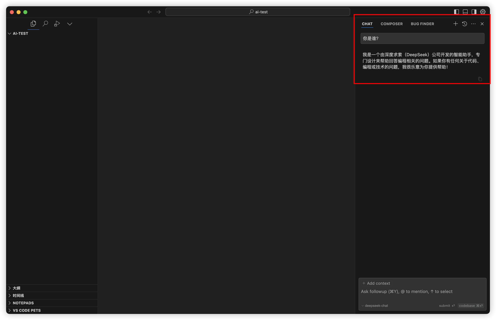

2. 在输入框中，输入【请帮我写个可以弹奏的钢琴键盘，谢谢】。

DeepSeek 会基于你的问题提示词，生成对应代码。

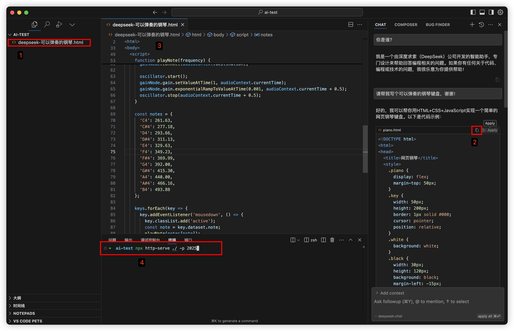

1. 拷贝生成的【钢琴键盘内容】，创建一个【HTML】文件，粘贴内容，保存，启动本地服务，即可在浏览器看到弹奏的钢琴键盘，弹奏还有声音哦。

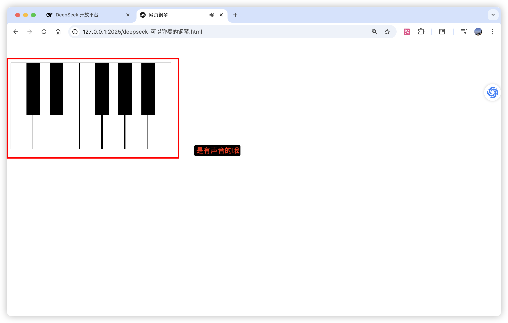

## 02  创建 DeepSeek API key

1. 登录 DeepSeek 官网 [https://deepseek.com/](https://deepseek.com/)，点击进入【接入API】。

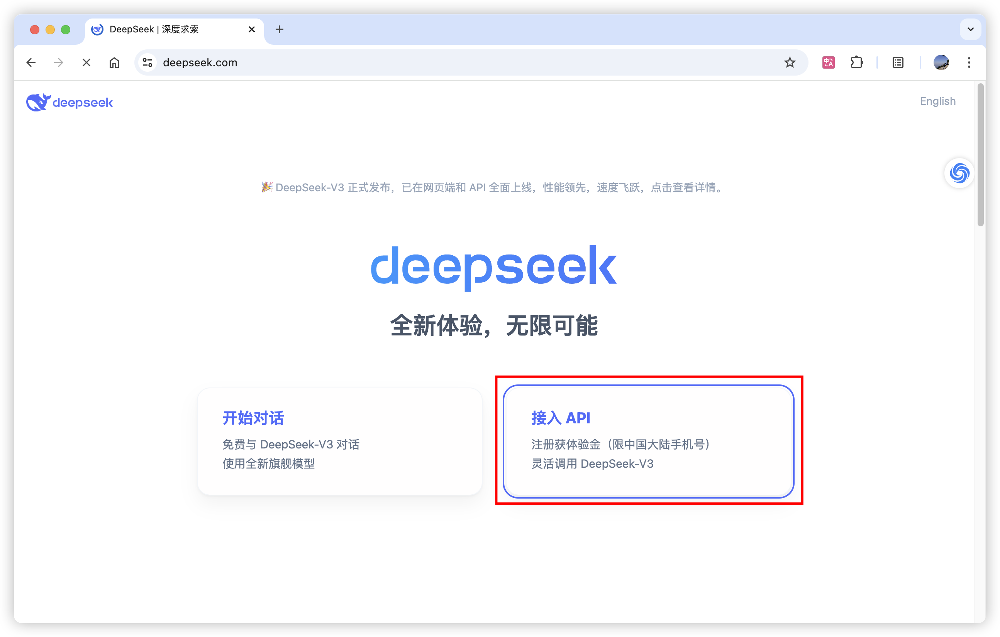

2. 选中左侧菜单【API keys】,点击按钮【创建 API key】，在弹框中输入名称。

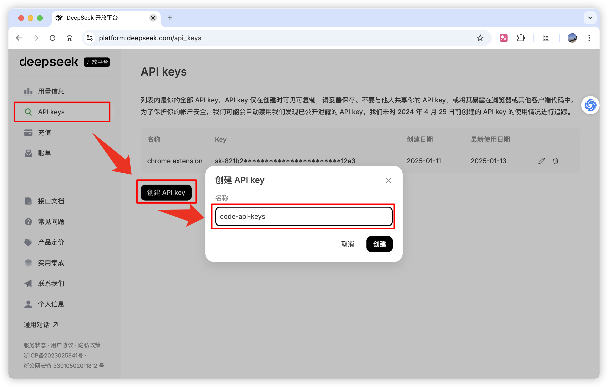

3. 点击弹框右下角按钮【复制】。

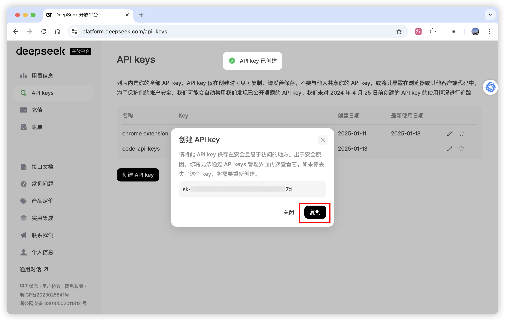

## 03   消费 DeepSeek API key

1. 在 Cursor 中，点击右上角图标【设置】。

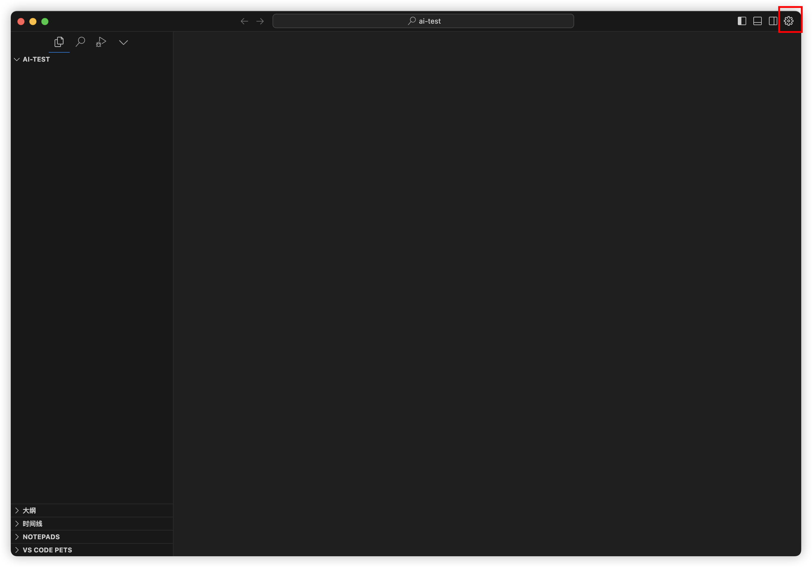

2. 选中左侧菜单【Model】,在展示的大模型列表中【取消勾选】大模型，然后点击按钮【+ Add model】。

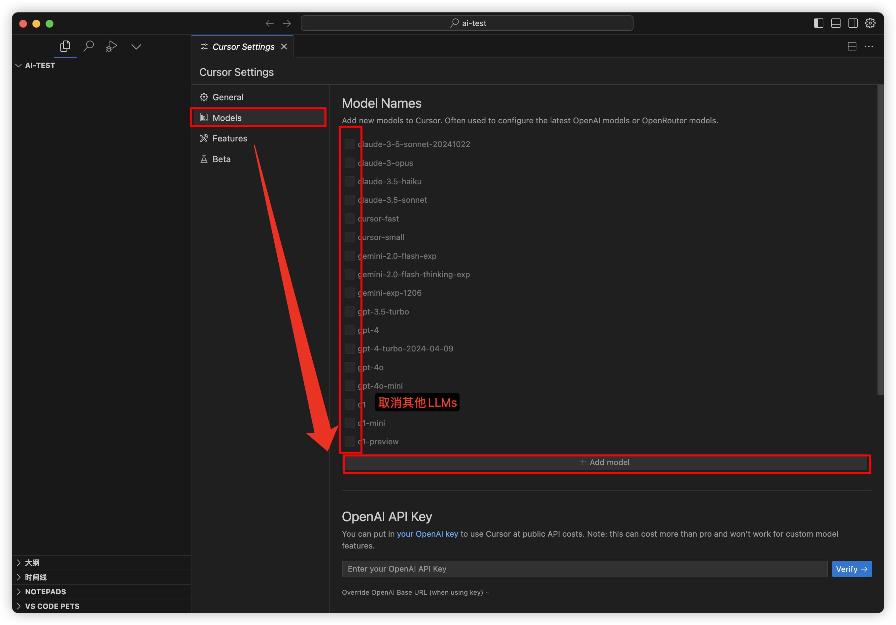

3. 输入大模型名称，比如【deepseek-chat】，然后粘贴刚才拷贝的【DeepSeek API key】，在 OpenAI Base URL输入【<https://api.deepseek.com/v1/>】，然后点击【Save】。

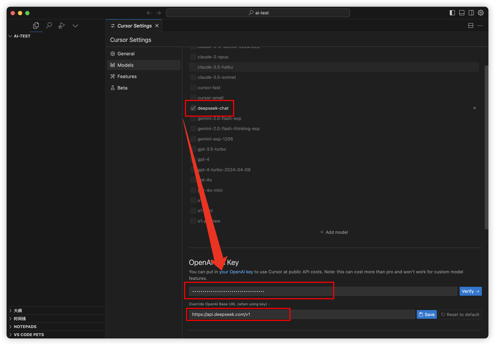

4. 点击按钮【Verify->】，出现一个弹框，点击弹框按钮【Enable OpenAI API Key】。

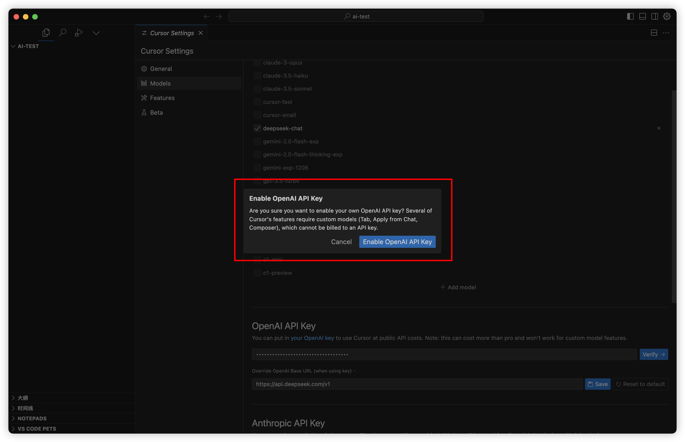

5. 刚才添加的 OpenAPI 的右侧会出现一个【开关】，且开关是打开的。

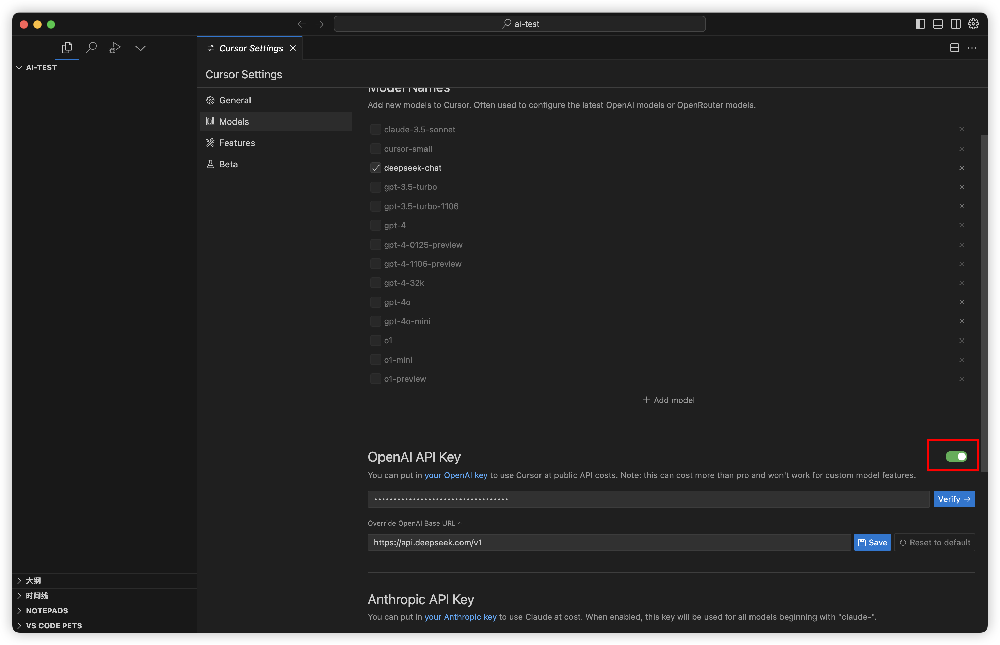

## 作者说

如果你想了解更多大模型的情况，或者想要了解 DeepSeek 在 Vscode 如何配置，请在评论区留言，我会在后续文章中更新。

（完，祝好~）