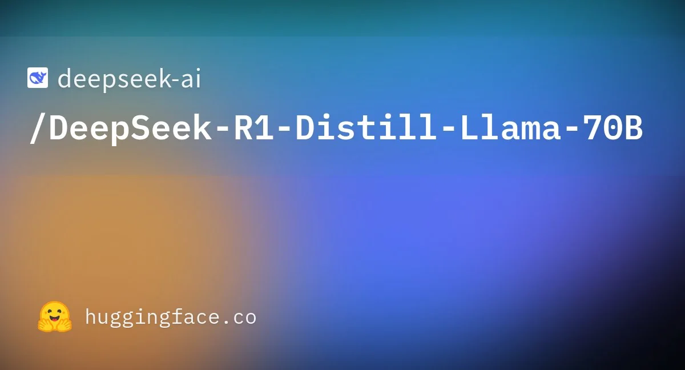
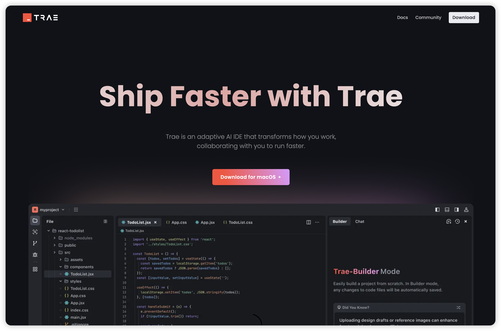
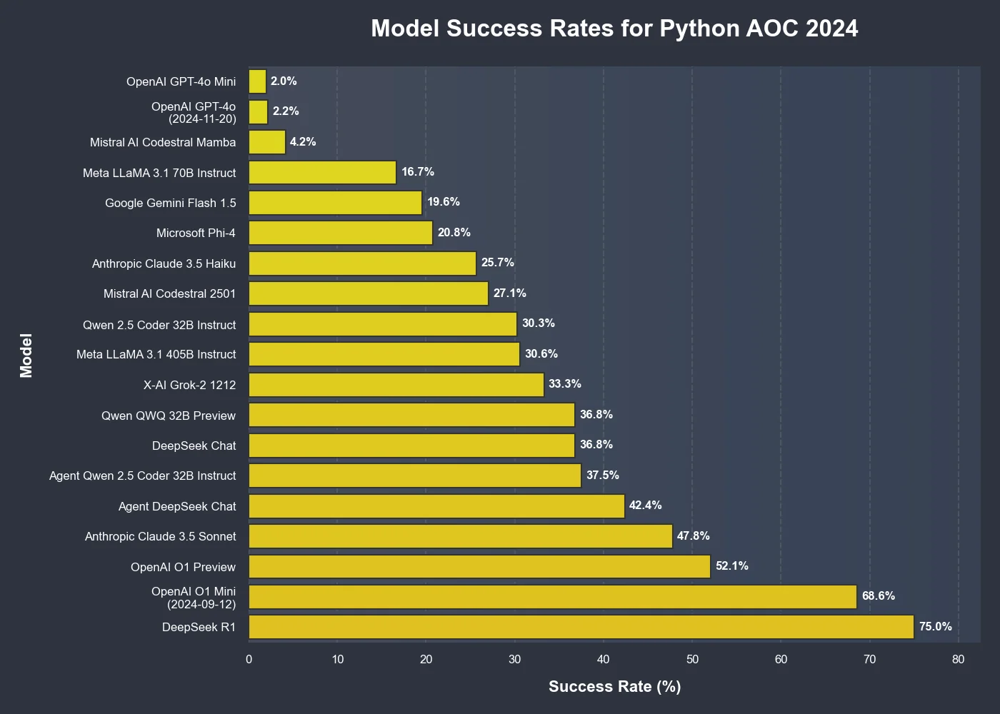
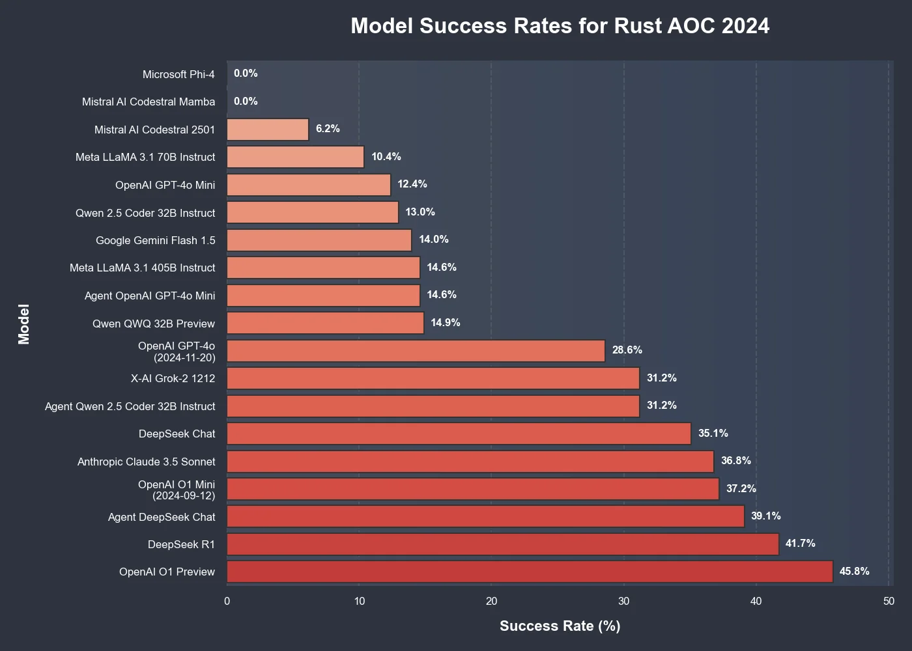
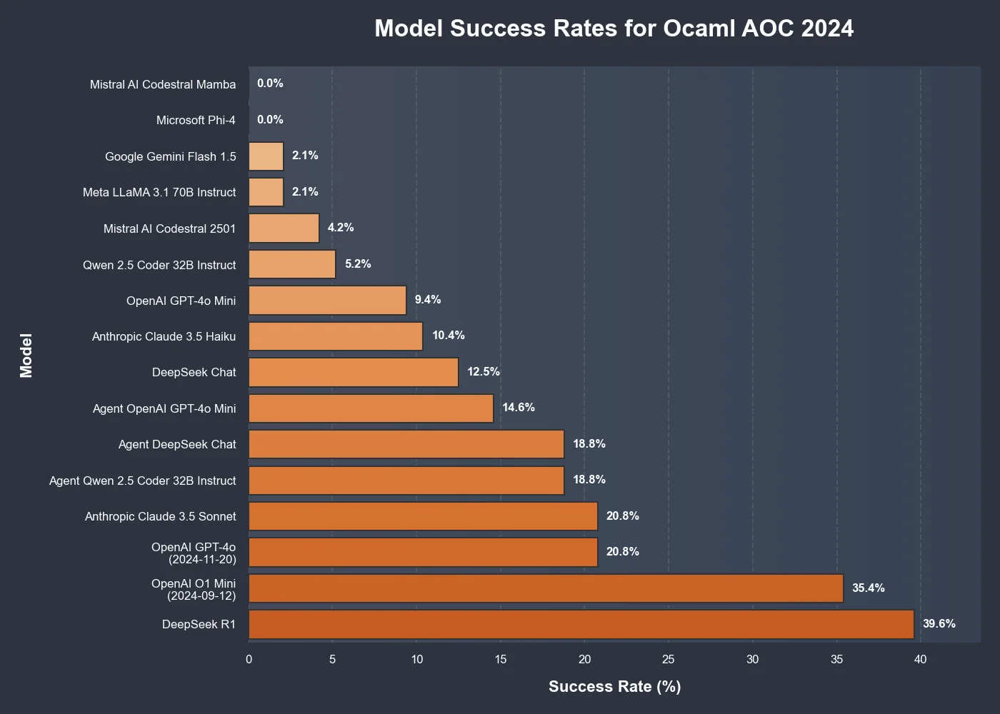
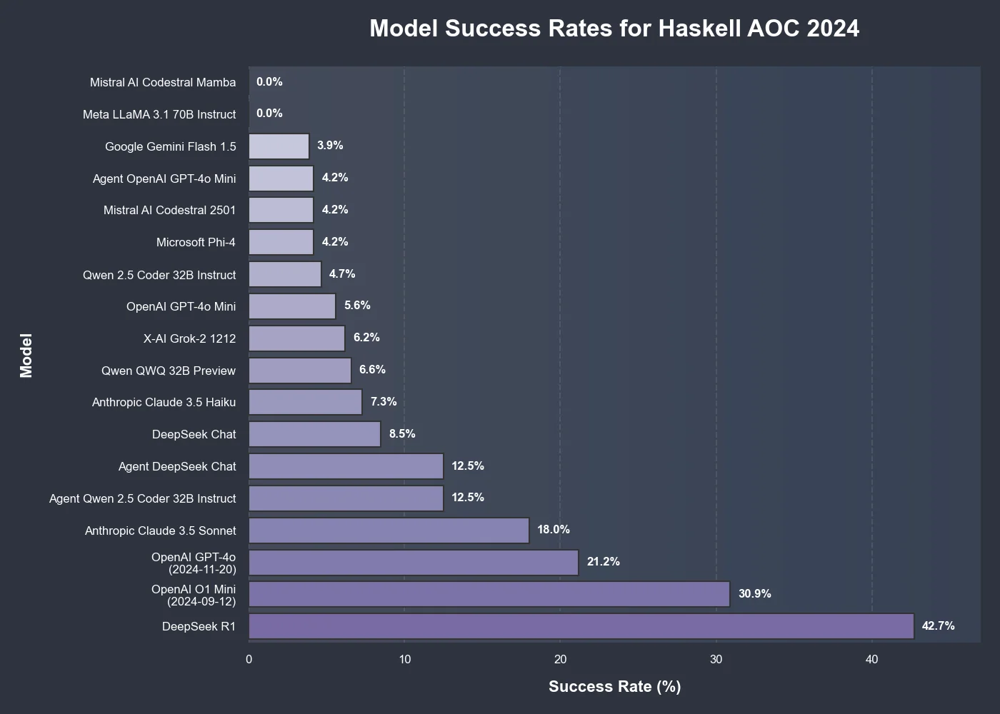
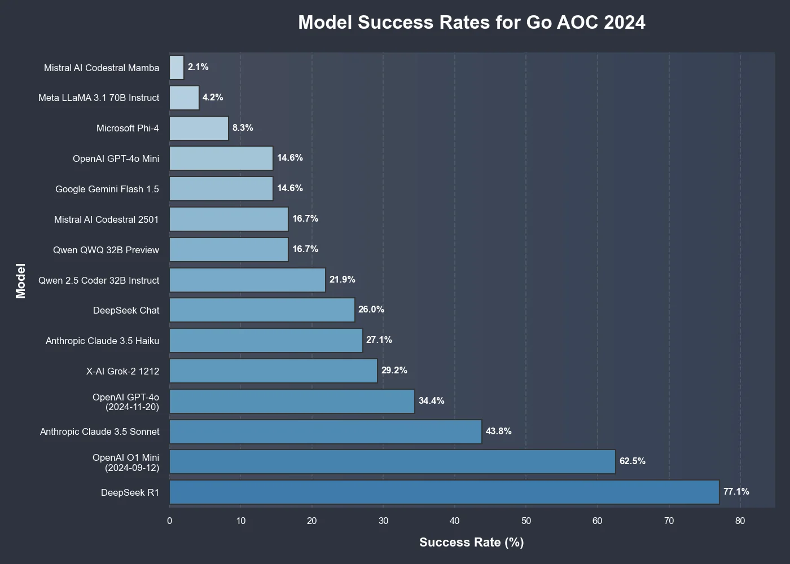
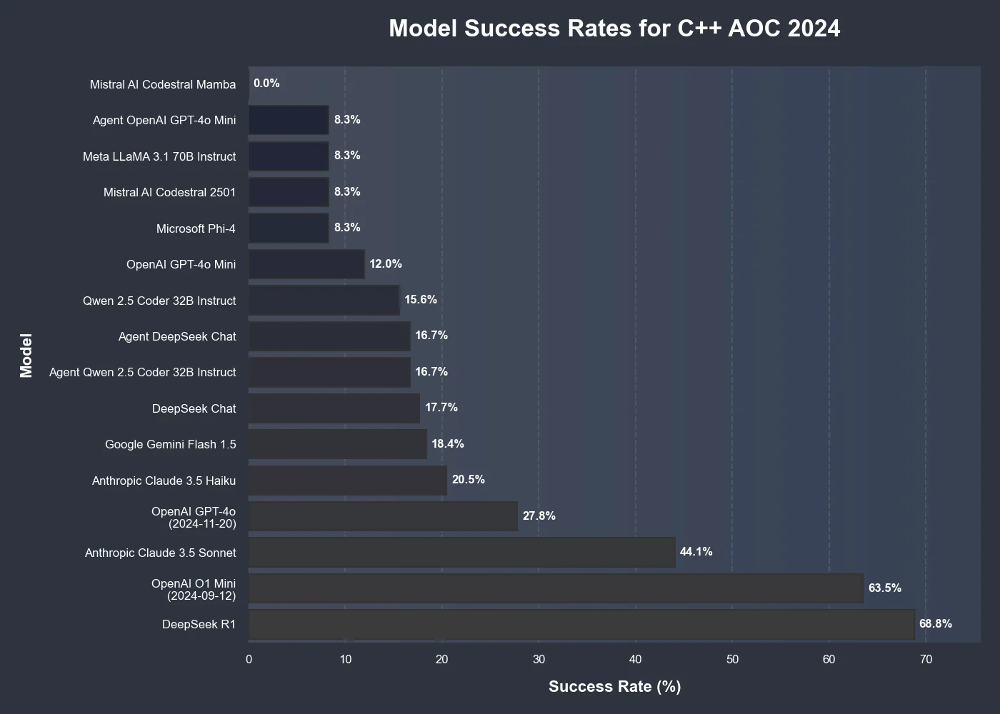

# 【AI动态】2025年1月20日·周一

## DeepSeek 上传了 6 个精简版（或蒸馏版）的 R1 模型

幻方量化旗下 AI 公司 DeepSeek 发布 DeepSeek-R1 模型，并同步开源模型权重。DeepSeek-R1 在后训练阶段大规模使用了强化学习技术，在仅有极少标注数据的情况下，极大提升了模型推理能力。在数学、代码、自然语言推理等任务上，性能比肩 OpenAI o1 正式版。

- [模型：deepseek-ai/DeepSeek-R1 · Hugging Face](https://huggingface.co/deepseek-ai/DeepSeek-R1)
- [查看其他人怎么看的](https://www.reddit.com/r/LocalLLaMA/comments/1i5or1y/deepseek_just_uploaded_6_distilled_verions_of_r1/)

## Trae 编辑器

Trae 是 The Real AI Engineer 的缩写，限时免费，可以使用 Sonnet 3.5，字节的产品体验做的也更到位。后续肯定会收费的，就像之前的Coze一样。

- [Trae 编辑器](https://www.trae.ai/)

## Advent of Code 2024 中的模型比较

- [查看其他人怎么看的](https://www.reddit.com/r/LocalLLaMA/comments/1i64up9/model_comparision_in_advent_of_code_2024/)

## 2025 年 AI 代理将如何颠覆 SaaS

这是一篇关于人工智能代理将在 2025 年如何颠覆 SaaS 的文章。它讨论了人工智能代理的演变、它们对 SaaS 的潜在影响以及支持它们发展的平台。文章强调，人工智能代理可以自动化任务、个性化体验并创造新的商业模式。它还讨论了人机界面的重要性以及设计人与人工智能代理之间有效沟通的挑战。

- [2025 年 AI 代理将如何颠覆 SaaS](https://medium.com/@oriziv4/how-ai-agents-will-disrupt-saas-in-2025-7567d793ca68)

## 使用 AI 完成的最复杂的编码

我发现人工智能对编码非常有帮助。按顺序为 Sonnet、o1 mini、Deepseek v3、llama 405。或本地 Qwen 32/14b。一般每天编码时都会用到。

它在 0 到 1 任务、翻译和一些故障排除方面表现出色。例如，编写一个执行此操作的应用程序或在 Rust 中执行此操作，将此代码制作为打字稿，询问导致此错误的原因。到目前为止，一旦项目建立并具有某种形式的内部框架，还没有很好的经验，这种情况总是会超出一定的规模。

要求所有模型将 200 行音频代码拆分为具有逻辑的反应类，并与其余部分反应 - 大多数人选择了正确的结构，但实现错过了一些独特的方面，并且开始看起来像 GitHub 上的任何开源实现.. o1 做得最好，没有正在工作。因此，即使是“低”复杂性的小代码重构也不适合。

分享您的经验。您能够使用人工智能解决的最复杂的任务是什么？一些上下文（例如代码库的大小、模型）会很有用。

- [查看其他人怎么看的](https://www.reddit.com/r/LocalLLaMA/comments/1i5hc4s/most_complex_coding_you_done_with_ai/)
