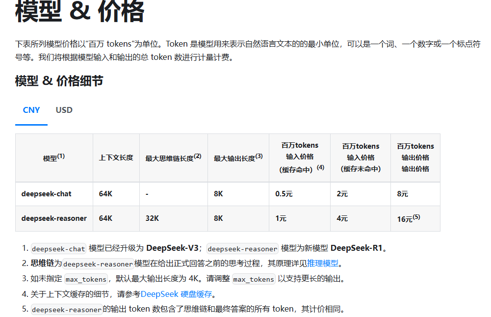
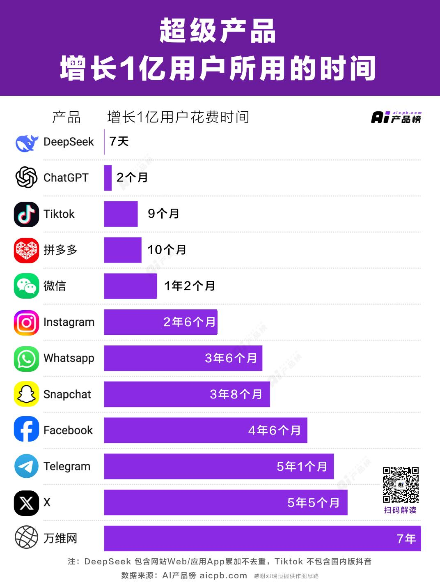

# 【AI动态】2025年2月

## 2月10日·周一

### 优惠期结束 DeepSeek涨价 输出token费用涨至每百万8元

DeepSeek-V3 API服务自2月9日起结束了为期45天的优惠体验期，调整了其价格策略。现在，每百万输入tokens的费用为0.5元（缓存命中）或2元（缓存未命中），而每百万输出tokens费用上调至8元，相比优惠期间每百万2元的价格，涨幅达到了300%。此次调价反映了DeepSeek当前服务器资源紧张的现状，官方已暂停API服务充值以避免对用户业务造成影响。尽管如此，百度智能云、华为云等多家平台已上线DeepSeek大模型，同时，国内外如亚马逊AWS、微软Azure等科技厂商也陆续接入DeepSeek模型，显示了市场对其技术的认可和需求。此外，英特尔等国际芯片巨头的合作进一步证明了DeepSeek在打破行业垄断方面的潜力。

[查看原文 ->](https://www.fromgeek.com/ai/671936.html)

### DeepSeek，搅了谁的局？

DeepSeek，一家中国AI初创公司，凭借其低成本高性能的V3和R1开源模型，在2025年初迅速崛起并引起全球关注。DeepSeek发布的模型性能接近OpenAI和Anthropic的产品，但训练成本显著降低，仅557.6万美元，这引发了算力概念股如英伟达股价的大幅波动。DeepSeek不仅在中国市场超越了豆包和Kimi等竞争对手，成为日活用户最多的聊天机器人应用，还通过其创新技术挑战了传统的“算力军备”范式，展示了“算法效率”路径的可行性。随着这一新动态，行业巨头被迫重新评估其商业模式和技术策略，而DeepSeek的成功也预示着AI产业将更加注重成本效益与实际应用落地。此外，DeepSeek的崛起提振了国产AI技术和硬件的发展信心，标志着2025年为AI商业化落地的重要一年。

[查看原文 ->](https://36kr.com/p/3160079163431425)

### DeepSeek横空出世，医疗AI迎来“国运时刻”

DeepSeek，作为国内原生的大模型，自推出以来便引起了广泛关注，并对医疗AI领域产生了重大影响。它不仅在技术上实现了创新，如采用混合专家模型提高了架构效率和降低了算力需求，而且其训练成本远低于同类产品，例如ChatGPT。DeepSeek的应用场景广泛，从C端用户的个人健康管理到B端的辅助诊断、病历书写等医生辅助工具，再到医疗AI“智能体”的开发，展示了其在提升医疗服务效率和质量方面的巨大潜力。尤其值得注意的是，方舟健客等企业已率先接入DeepSeek，利用其强大的数据分析能力和推理能力优化业务流程，提高工作效率。随着DeepSeek的持续发展，预计将进一步推动医疗行业的智能化与普惠化。

[查看原文 ->](https://36kr.com/p/3160049524152833)

## 2月9日·周日

## AI.com现在重定向到DeepSeek

看起来AI.com现在正在重定向到DeepSeek而不是Chatgpt。考虑到AI.com一直指向Openai的Chatgpt已有一段时间，这是一个令人惊讶的举动。

[查看其他人怎么看的 ->](https://www.reddit.com/r/LocalLLaMA/comments/1il2vwi/aicom_now_redirects_to_deepseek/)

### 我所知道的有关微调的全面概述

I’ve been working on fine-tuning LLMs a bit later than everyone else (among the ones I know), and I’ve struggled to understand why I’m doing what I’m doing. I’ve compiled a small collection of everything I know about fine-tuning LLMs or transformer models for specific use cases. I’d like to hear your thoughts on these things!

[查看其他人怎么看的 ->](https://www.reddit.com/r/LocalLLaMA/comments/1ilkamr/a_comprehensive_overview_of_everything_i_know/)

## 2月8日·周六

### 软银即将完成对 OpenAI 的 400 亿美元投资，超越微软成为最大金主

软银即将完成对OpenAI的400亿美元投资，投前估值为2600亿美元，投后估值达3000亿美元。资金将在未来12至24个月内支付，第一笔款项最快于春季到账。投资完成后，软银将超越微软，成为OpenAI的最大投资方。部分资金将用于OpenAI与软银、甲骨文合资的“星际之门”项目。

[查看原文 -](https://www.ithome.com/0/829/290.htm)