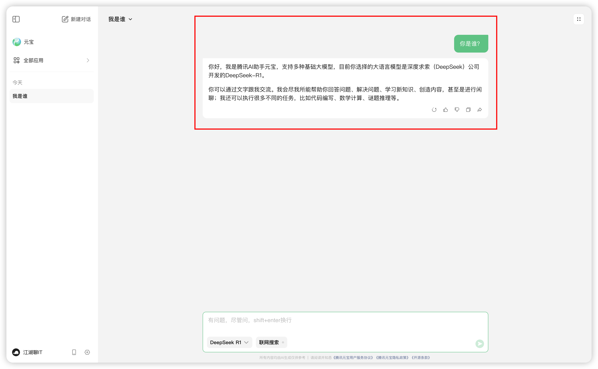

# DeepSeek-R1在腾讯元宝接入，也太丝滑了吧

手机内存大、电脑内存大的朋友们，**新福利**来了：DeepSeek-R1 在腾讯「元宝」中正式上线，体验起来非常丝滑！

大家都知道：自今年春节 DeepSeek-R1 火遍全网以来，各家云服务都在陆续接入 DeepSeek-R1，就在 2025年2月13日，腾讯主力AI应用「元宝」宣布正式接入 「DeepSeek-R1 满血版模型」，今天测试的过程中，再也见不到「服务器繁忙」，也太丝滑了吧。

还等什么，赶紧看看怎么操作，先用起来！要知道：

## 01   手机版

考虑到现代人日常投入到手机上的时间较多，我们先从手机版体验开始。

### 下载或更新

- 还未下载「元宝」的朋友，直接去应用市场搜索「元宝」，点击「下载」即可体验。
- 已下载过「元宝」的朋友，也是去应用市场搜索「元宝」，点击「更新」即可体验。

### 切换模型

在顶部将模型从「Hunyuan」切换为「DeepSeek R1」

### 验证和使用

输入框输入提示词：**你是谁？**

**注意啦**，友好体验：

1. 右下角左边「音频」图标，点击支持语音播放，这对喜欢「听」的朋友来说，非常友好。
2. 右下角右边第一个「复制」图标，点击支持复制，这对喜欢「复制」的朋友来说，非常友好。
3. 右下角最后一个「分享」图标，点击后，你会发现除了能分享给微信的朋友，还支持「链接」和「图片」，一会看下图就知道了。

### 看看推理能力

为了验证效果，我们将「联网搜索」关闭掉，避免受网络搜索资源结果的干扰。看看它的回答吧！

输入框输入提示词：**未来10年贬值最快的物品是什么？**

这是未开启「联网搜索」的效果，是不是推理还是非常严谨的。

### 看看联网搜索能力

输入框输入提示词：**或者的意义在于什么？**

## 02   电脑版

### 先上链接并切换模型

「元宝」网页版地址：[https://yuanbao.tencent.com/chat](https://yuanbao.tencent.com/chat)

### 看看推理能力

输入框输入提示词：**人生有什么意义？**

**注意**：此时未开启「联网搜索」，这无需查看其他网络资源，就是需要它自我推理。

总体来说还是可以的，有深度思考，回答内容也不错。

### 看看联网搜索能力

输入框输入提示词：**《哪吒2》截止目前总票房多少了？其取得的成绩有什么意义？**

点开第 1 个引用资源的链接，来自公众号文章，时间是今天（2025.2.15）发布的：

点开第 2 个引用资源的链接，依旧来自公众号文章，时间是今天（2025.2.15）发布的：

可以看到，参考的例子不是很多，就 8 篇。点开链接很多是「微信公众号」文章，这个其实比其他家大模型联网资源质量会相对高一点。腾讯元宝的搜索更像是微信的「搜一搜」，其他家的就是「网页搜索框搜索」。

腾讯元宝这点就对公众号文章创作者比较有利，你的文章可以直接被其他人所搜索到，有了更多的搜索途径。

## 作者说

当下，大模型使用工具会很多，几乎没几天就会出现大模型新资讯，我的想法是：有好工具就先用着，等工具成熟了，再去研究工具的原理。你怎么看？

打广告：作者常以「江湖聊IT」为名混迹于技术圈，创有：[博客](https://www.fullstack.ren/)、[公众号](https://mp.weixin.qq.com/s/SCcPX66geeCfg1Eu-JGmcg)、[掘金](https://juejin.cn/user/1046390799881463)、[Github](https://github.com/fullstackren/)（点个 star 鼓励下持续创作） 和[抖音](https://www.douyin.com/user/MS4wLjABAAAAra__2Du0aaHbtq2dve76uHX5MV-HaAeDiBf7wVvhHZc)。

（完，祝好~）
